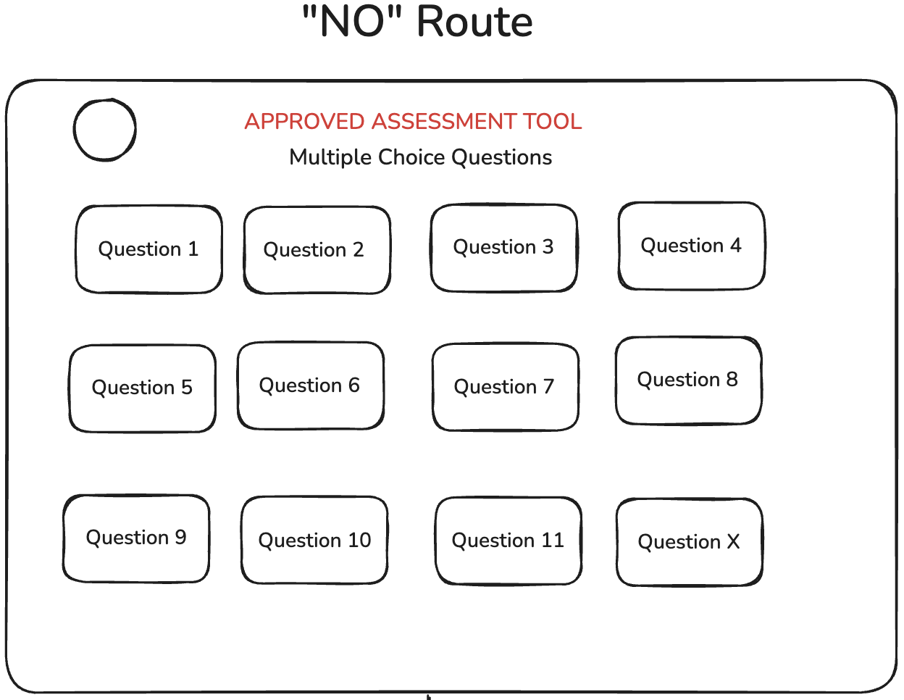
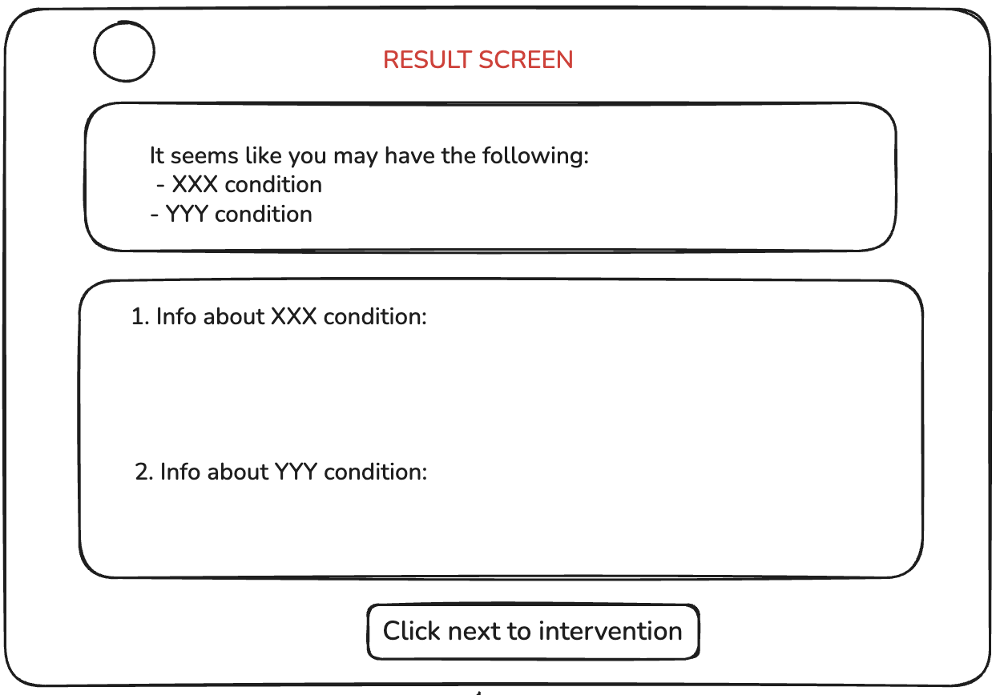
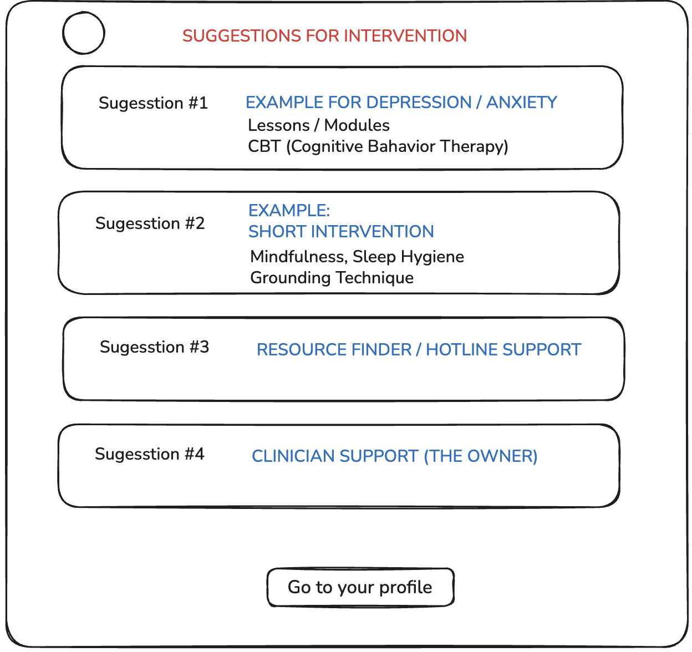
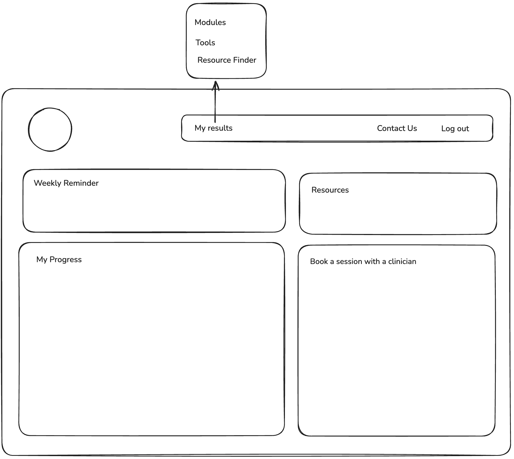

# Project Haven

- A client (pshycho therapist) wants to create a web app that is accessible to everyone, that is practical, evident-based.
- The app helps to idenitfy symptoms and learn what to do from a psychological point of view.
- The app will connect them to safe eveident-based strategy and resources.

## Step 1 - Sign up
- User has to sign up.
  - Age
  - Name
  - Email

- Once signed up, user has to create a profile:
  - Gender
  - Nationality
  - Background
  - Religion
  - Consent form + privacy (This is not medical advice) to finalize profile

## Step 2 - Assessment
  Do a suicide assessment. Safety check for suicidal ideation.
  - If positive (Yes) ---> Direct to immediate support and resources: suicidal hotline
  - If negative (No) ---> Proceed to different screening tool

{ width=600px }
 
 Use approved assessment tool to screen users. User will do a serries of multiple choice questions. The result will be generated once they completed.
{ width=600px }
 
 Based on the user's answers, the approriate suggestions will be provided. This will tell us what condition they have. User can follow personalized suggestions for intervention
 { width=600px }
 

### Home Screen

## Design Inspo

{ width=600px }

{ width=600px }

